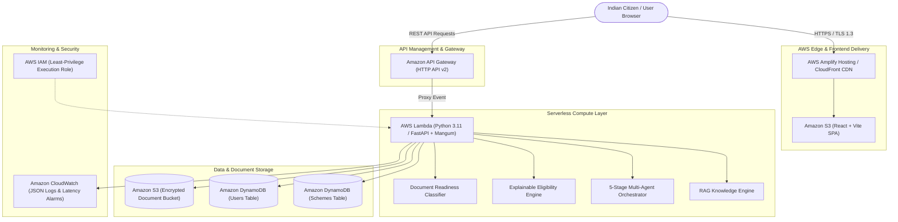

# CivicAid AI 🇮🇳
### *An Agentic Eligibility & Benefits Navigator for Indian Citizens*

CivicAid AI is an intelligent welfare discovery, explainable eligibility evaluation, and application copilot platform designed for Indian citizens. It bridges the gap between complex Central/State government schemes and the citizens who need them the most—including small landholding farmers, undergraduate students, women entrepreneurs, gig workers, and low-income families.

---

## 🏗️ System Overview & Modules

1. **Module 1 & 2**: Fast Profile Wizard & Citizen Passport with completion scoring and persistent local draft storage.
2. **Module 3**: Scheme Knowledge Base with 26 verified Central and State welfare programs with authentic `.gov.in` domain sources.
3. **Module 4**: Local RAG Knowledge Engine (Sublinear TF-IDF + Cosine Similarity) with verbatim evidence citations and zero paid external API dependencies.
4. **Module 5**: 5-Stage Multi-Agent Eligibility System (Profile Analyzer -> Scheme Discovery -> Eligibility Verification -> Document Agent -> Application Guide).
5. **Module 6**: Explainable Eligibility Engine evaluating 11 normalized dimensions with deterministic audit traces.
6. **Module 7**: Document Readiness Checker supporting PDF/Image analysis, PII masking (`XXXX-XXXX-1234`), and manual checklist fallback.
7. **Module 8**: Application Copilot with a 5-step guided workflow, official government portal linking, and an offline Application Reference Number (ARN) locker.
8. **Module 9**: Production-ready AWS Serverless Cloud Deployment (SAM template, Amplify Hosting, API Gateway, Lambda, DynamoDB, S3, CloudWatch).

---

## ☁️ AWS Architecture



---

## 🛠️ AWS Services Used & Why Each Service Is Used

| AWS Service | Architecture Role | Why This Service Is Used |
| :--- | :--- | :--- |
| **AWS Amplify Hosting / CloudFront** | Frontend Web Delivery | Global CDN edge caching, automated Git deployments, instant cache invalidation, and custom domain SSL management. |
| **Amazon API Gateway (HTTP API v2)** | API Ingestion & CORS | 70% cheaper and lower latency than REST APIs, native CORS handling, automatic request throttling, and seamless Lambda proxying. |
| **AWS Lambda (Python 3.11)** | Compute & Application Logic | Scale-to-zero model with zero idle costs, sub-second cold starts via Mangum ASGI adapter, and maintenance-free execution. |
| **Amazon DynamoDB** | Schemes & User Data | Millisecond single-digit response times at any scale, Pay-Per-Request (On-Demand) pricing, and automatic point-in-time recovery. |
| **Amazon S3** | Data & Document Staging | 99.999999999% durability, default AES-256 server-side encryption, and granular lifecycle rules to expire temporary uploads. |
| **Amazon CloudWatch** | Structured Logging & Alarms | Centralized JSON structured log ingestion with CloudWatch Logs Insights, error metrics, and operational alarms. |
| **AWS IAM** | Security & Access Control | Least-privilege execution roles ensuring Lambda only accesses specific application tables and buckets. |

---

## 💰 Cost Considerations

CivicAid AI uses a purely serverless design that fits comfortably within the **AWS Free Tier**:
- **AWS Lambda**: 1,000,000 free requests per month + 3.2M seconds of compute time.
- **Amazon DynamoDB**: 25 GB free storage and millions of on-demand read/write units.
- **Amazon S3**: 5 GB standard cloud storage.
- **Amazon CloudWatch**: 5 GB free log data ingestion.
- **Estimated Production Cost (100,000 monthly active users)**: ~$3.50 to $5.00 / month total.

---

## 🔒 Security Considerations

1. **Encryption**: All traffic strictly enforced over HTTPS / TLS 1.3. S3 and DynamoDB data encrypted at rest via AWS KMS (AES-256).
2. **PII Masking & Privacy Policy**: Aadhaar (`XXXX-XXXX-1234`) and PAN numbers (`ABXXXXX12C`) are automatically masked before logging or storage.
3. **Zero Automated Government Submissions**: The system strictly prepares citizens and links directly to verified `.gov.in` / `.nic.in` portals without submitting fake or unverified data to external systems.
4. **Least-Privilege Roles**: IAM execution roles restrict Lambda permissions to only the explicit DynamoDB tables and S3 buckets created in the CloudFormation stack.

---

## ⚡ Quick Start (Local Development)

### 1. Backend Setup
```bash
# Install Python dependencies
pip install -r requirements.txt

# Run the FastAPI server locally
uvicorn backend.app.main:app --reload --port 8000
```
- API Health Check: `http://localhost:8000/health`
- Interactive API Docs: `http://localhost:8000/docs`

### 2. Frontend Setup
```bash
cd frontend
npm install
npm run dev
```
- Web Application: `http://localhost:5173`

### 3. Deploy to AWS via SAM
```bash
# Build and deploy AWS Serverless Stack
sam build -t infra/template.yaml
sam deploy --guided
```

---

## 🛡️ License
MIT License. Built for the 2026 AI GovTech Hackathon.
