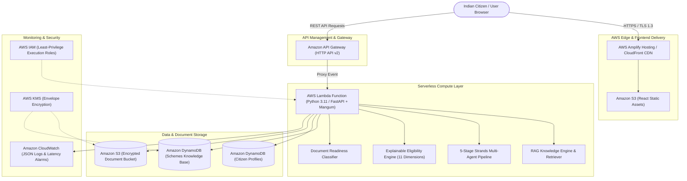

# CivicAid AI — AWS Serverless Cloud Architecture

CivicAid AI is designed with a modern, resilient, high-availability, zero-maintenance serverless architecture deployed on Amazon Web Services (AWS).

---

## 1. High-Level AWS Architecture Diagram

---

## 2. AWS Services Used & Why Each Service Is Chosen

| AWS Service | Component Role | Why Chosen |
| :--- | :--- | :--- |
| **AWS Amplify Hosting / CloudFront** | Frontend Web App Delivery | Global low-latency CDN, automatic SSL certificate provisioning, continuous Git deployments, and instant cache invalidation. |
| **Amazon API Gateway (HTTP API v2)** | REST API Ingestion & Routing | 70% cheaper and lower latency than REST APIs, native CORS management, built-in throttling, and seamless Lambda proxy integration. |
| **AWS Lambda (Python 3.11)** | Compute & Business Logic | True serverless scale-to-zero model ($0 idle cost), sub-second cold starts with Mangum ASGI, and zero server maintenance overhead. |
| **Amazon DynamoDB** | Schemes & User Profiles | Millisecond latency at any scale, Pay-Per-Request (On-Demand) billing, native JSON document support, and automatic Point-in-Time Recovery. |
| **Amazon S3** | Data & Document Staging | 99.999999999% (11 9's) durability, default AES-256 encryption, granular lifecycle policies to expire temporary uploads, and high throughput. |
| **Amazon CloudWatch** | Structured Logging & Metrics | Real-time JSON log aggregation via CloudWatch Logs Insights, request tracing, and automated operational alarms. |
| **AWS IAM** | Identity & Access Management | Granular role-based access control ensuring the Lambda function only accesses assigned tables and buckets. |

---

## 3. Cost Considerations (Optimized for Free Tier & Scale)

CivicAid AI's architecture is strictly serverless, ensuring **$0.00 idle cost** and minimal operational expense:

1. **AWS Free Tier Coverage**:
   - **AWS Lambda**: 1,000,000 free requests/month and 3.2 million seconds of compute time.
   - **Amazon DynamoDB**: 25 GB of free storage and 25 provisioned write/read capacity units (or millions of on-demand requests).
   - **Amazon S3**: 5 GB of standard storage in the free tier.
   - **Amazon CloudWatch**: 5 GB of log data ingestion and 10 custom metrics free.
2. **Estimated Production Cost (100,000 Active Monthly Users)**:
   - API Gateway: $0.10
   - AWS Lambda (512MB, 150ms avg): $1.25
   - DynamoDB: $1.50
   - S3 Storage & Egress: $0.50
   - **Total Estimated Monthly Cloud Cost: ~$3.35 - $5.00 / month**.

---

## 4. Security & Compliance Considerations

1. **Data in Transit**: All communication between citizen browsers, CloudFront, API Gateway, and Lambda is strictly enforced over **HTTPS / TLS 1.3** with modern cipher suites.
2. **Data at Rest**:
   - DynamoDB tables use AWS KMS encryption with automated key rotation.
   - S3 buckets use default `AES256` server-side encryption and have `BlockPublicAcls` & `BlockPublicPolicy` enabled.
3. **PII Masking & Privacy-First Policy**:
   - Aadhaar numbers (`XXXX-XXXX-1234`) and PAN details (`ABXXXXX12C`) are automatically masked prior to log emission or database storage.
   - CivicAid AI never stores biometric records or sensitive document files permanently.
4. **Least-Privilege IAM**:
   - The Lambda execution role only contains scoped `DynamoDBCrudPolicy` and `S3CrudPolicy` restricted to the explicit stack resources.

---

## 5. Local vs Cloud Parity

CivicAid AI maintains **100% local functionality** when operating offline or during local development:
- If AWS credentials or DynamoDB endpoints are absent, the repository layer automatically switches to local verified JSON storage (`data/schemes.json`) and local vector embeddings with zero disruption.
